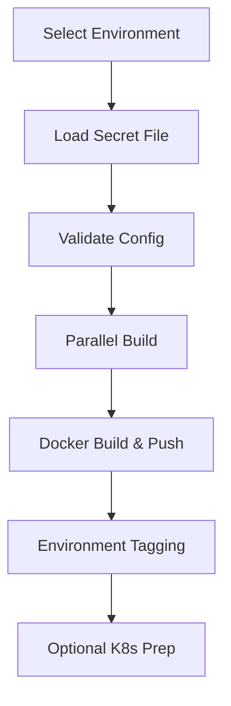

# 🚀 Enhanced Jenkinsfile with Secret Environment Files

## 🎯 What Changed

The Jenkinsfile has been enhanced to use **Jenkins Secret Files** instead of storing `.env.*` files in Git. This provides better security and environment management.

## 🔧 Key Features

### 1. **Secret File Integration**
- Loads environment files from Jenkins credentials
- Supports `dev`, `staging`, and `prod` environments  
- Validates environment files automatically
- Never exposes secrets in logs

### 2. **Environment-Specific Builds**
- Different configurations per environment
- Environment-specific Docker image tagging
- Conditional deployment preparation
- Smart resource allocation per environment

### 3. **Enhanced Security**
- All sensitive data in Jenkins credentials
- Environment file validation
- Secure credential handling
- No secrets in Git repository

## 📋 Setup Checklist

### ✅ Files Created:
- `Jenkinsfile-with-env-management` - Enhanced pipeline
- `env-templates/.env.dev` - Development template
- `env-templates/.env.staging` - Staging template  
- `env-templates/.env.prod` - Production template
- `env-templates/SETUP_GUIDE.md` - Complete setup guide

### 🔐 Required Jenkins Credentials:

| Credential ID | Type | Description |
|---------------|------|-------------|
| `dockerhub-credentials` | Username/Password | Docker Hub access |
| `env-file-dev` | Secret File | Development environment |
| `env-file-staging` | Secret File | Staging environment |
| `env-file-prod` | Secret File | Production environment |

### 🛠️ Next Steps:

1. **Customize Environment Files**:
   ```bash
   # Edit the template files:
   - tools/Jenkins/env-templates/.env.dev
   - tools/Jenkins/env-templates/.env.staging  
   - tools/Jenkins/env-templates/.env.prod
   
   # Replace:
   - yourdomain.com → your actual domain
   - CHANGE_ME_* → secure values
   - Configure database passwords
   - Set up cloud credentials (if needed)
   ```

2. **Upload to Jenkins**:
   - Go to Jenkins → Manage Credentials
   - Upload each `.env.*` file as a Secret File
   - Use exact credential IDs as specified

3. **Update Your Main Jenkinsfile**:
   ```bash
   # Replace current Jenkinsfile with the enhanced version:
   cp tools/Jenkins/Jenkinsfile-with-env-management tools/Jenkins/Jenkinsfile
   ```

4. **Test the Pipeline**:
   - Run with `ENVIRONMENT=dev` first
   - Verify environment file loading
   - Check Docker image tagging
   - Test different environments

## 🎯 Pipeline Parameters

When running builds:
- **ENVIRONMENT**: `dev`, `staging`, or `prod`
- **SKIP_TESTS**: Skip tests for faster builds
- **DEPLOY_AFTER_BUILD**: Prepare K8s deployment

## 🔄 Environment-Specific Image Tags

The pipeline now creates environment-specific Docker tags:

```bash
# Development build:
adityagaikwad888/chattingo-backend:dev-123
adityagaikwad888/chattingo-frontend:dev-123

# Production build:  
adityagaikwad888/chattingo-backend:prod-123
adityagaikwad888/chattingo-frontend:prod-123

# Plus compatibility tags:
adityagaikwad888/chattingo-backend:123
adityagaikwad888/chattingo-backend:latest
```

## 🔒 Security Benefits

✅ **Git Security**: No secrets in repository  
✅ **Environment Isolation**: Separate configs per environment  
✅ **Credential Management**: Jenkins-managed secret files  
✅ **Validation**: Automatic environment file validation  
✅ **Audit Trail**: Jenkins logs all credential access  

## 📊 Pipeline Flow



## 🚀 Ready for Production!

Your Chattingo pipeline now supports:
- **Multi-environment deployments**
- **Secure credential management**  
- **Environment-specific configurations**
- **Production-ready security practices**

Follow the `SETUP_GUIDE.md` to complete the Jenkins configuration and you'll have a robust, secure CI/CD pipeline! 🎉
